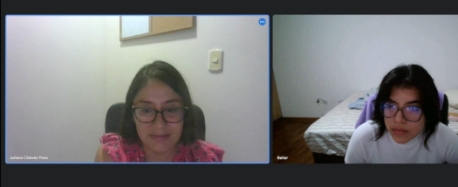

**Universidad Peruana de Ciencias Aplicadas**

Ingeniería de software

Desarrollo de Aplicaciones Open Source

SW57

**Informe del Trabajo Final**

Velasquez Nuñez, Angel Augusto

FiveStarts

*“RocketNotes”*

|        **Integrantes**        |**Código**|
|:-----------------------------:| :-: |
|   Dam Rubianes, Frida Sofía   |U202218352|
|La Torre Soto, André Sebastian |U202217772|
| Vilchez Rios, Mateo Alejandro |U202210059|
|  Ramos Rios, Belen del Rocio  |U202216246|
|Serrano Ircañaupa, Nelson Elías|
U202214733

|

Marzo de 2024-01

### **Registro de Versiones del Informe**

|**Versión**|**Fecha**|**Autor**|                        **Descripción de modificación**                         |
| :-: | :-: | :-: |:------------------------------------------------------------------------------:|
|TB1|23/03/2024|Belen Ramos|                   Desarrollo del capítulo I: Startup Profile                   |
|TB1|24/03/2024|Mateo Vilchez|                  Desarrollo del capítulo I: Solution Profile                   |
|TB1|24/03/2024|Frida Dam|                  Desarrollo del capítulo I: Solution Profile                   |
|TB1|24/03/2024|Mateo Vilchez|                 Desarrollo del capítulo I: Segmentos Objetivos                 |
|TB1|26/03/2024|Nelson Serrano|                    Desarrollo del capítulo II: Competidores                    |
|TB1|30/03/2024|Belen Ramos|                    Desarrollo del capítulo II: Entrevistas                     |
|TB1|31/03/2024|Andre La Torre|                    Desarrollo del capítulo II: Needfinding                     |
|TB1|01/04/2024|Andre La Torre|              Desarrollo del capítulo III: To-Be Scenario Mapping               |
|TB1|07/04/2024|Frida Dam|                   Desarrollo del capítulo III: User Stories                    |
|TB1|08/04/2024|Belen Ramos|                   Desarrollo del capítulo III: User Stories                    |
|TB1|08/04/2024|Mateo Vilchez|                  Desarrollo del capítulo III: Impact Mapping                   |
|TB1|09/04/2024|Nelson Serrano|                  Desarrollo del capítulo III:Product Backlog                   |
|TB1|11/04/2024|Frida Dam|                  Desarrollo del capítulo IV: Style Guidelines                  |
|TB1|12/04/2024|Frida Dam|             Desarrollo del capítulo IV: Information Architecture.              |
|TB1|09/04/2024|Mateo Vilchez|               Desarrollo del capítulo IV: Landing Page UI Design               |
|TB1|10/04/2024|Mateo Vilchez|           Desarrollo del capítulo IV: Web Applications UX/UI Design            |
|TB1|12/04/2024|Frida Dam|            Desarrollo del capítulo IV: Web Applications Prototyping            |
|TB1|10/04/2024|Nelson Serrano|        Desarrollo del capítulo IV: Domain-Driven Software Architecture         |
|TB1|13/04/2024|Belen Ramos|         Desarrollo del capítulo IV: Software Object-Oriented Design.           |
|TB1|13/04/2024|Belen Ramos|                  Desarrollo del capítulo IV: Database Design                   |
|TB1|13/04/2024|Mateo Vilchez|         Desarrollo del capítulo V: Software Configuration Management.          |
|TB1|13/04/2024|Nelson Serrano|         Desarrollo del capítulo V: Software Configuration Management.          |
|TB1|14/04/2024|Nelson Serrano|Desarrollo del capítulo V: Landing Page, Services & Applications Implementation.|
|TB1|14/04/2024|Andre La Torre|Desarrollo del capítulo V: Landing Page, Services & Applications Implementation.|
|TP|27/04/2024|Frida Dam|                Corrección del Solution Profile: Lean UX Canvas                 |
|TP|27/04/2024|Nelson Serrano|                    Corrección del capítulo V: Landing Page                     |
|TP|26/04/2024|Belen Ramos|                    Corrección del capítulo II: Entrevistas                     |
|TP|26/04/2024|Andre La Torre|                    Corrección del capítulo II: Needfinding                     |
|TP|27/04/2024|Mateo Vilchez|                  Corrección del capítulo III: Impact Mapping                   |
|TP|27/04/2024|Mateo Vilchez|           Corrección del capítulo IV: Web Applications UX/UI Design            |
|TP|01/05/2024|Belen Ramos|                 Desarrollo de User Stories: Technicals Stories                 |

### **Student Outcome**

|**Criterio Específico**|**Acciones Realizadas**|**Conclusiones**|
| :- | :- | :- |
|Comunica oralmente sus ideas y/o resultados con objetividad a público de diferentes especialidades y niveles jerárquicos, en el marco del desarrollo de un proyecto en ingeniería.|
**Mateo Vilchez Rios**

**TB1**

Durante el desarrollo del perfil de la solución, explicaba regularmente los objetivos del proyecto y las especificaciones técnicas, garantizando que cada miembro del equipo estuviese al día con los avances y los cambios en el diseño del proyecto.

**TP1**

Enfrenté desafíos técnicos durante esta entrega, pero me aseguré de comunicar mis inconvenientes a mis compañeros para que el trabajo no se viera afectado. Además, busqué motivar a mis compañeros para que pudieran terminar sus asignaciones correspondientes.

**Belen Ramos Rios**

**TB1**

Mi contribución en esta fase fue fundamental para asegurar que todos los aspectos del perfil de startup fueran comunicados claramente. Participé activamente en el desarrollo y presentación de los perfiles de usuarios y en las discusiones sobre el diseño de la base de datos y la arquitectura del software.

**TP1**

Asumí un papel clave en la revisión y corrección de las metodologías de entrevista, comunicando los problemas y ajustes necesarios para asegurar la recopilación eficaz de datos que informarían las siguientes etapas del proyecto.

**Frida Dam Rubianes**

**TB1**

Durante el trabajo se aplicaron técnicas como la de  lluvias de ideas para poder lograr comunicar nuestros puntos de vista y obtener resultados favorables. 

**TP1**

Cada integrante del equipo comunicó sus resultados en cada sesión de trabajo y trabajamos con sprints.

**Nelson Elías Serrano Ircañaupa**

**TB1**

Durante el desarrollo del capítulo II sobre competidores, me enfoqué en presentar un análisis detallado y objetivo de los competidores clave, asegurando que el equipo comprendiera las fortalezas y debilidades de cada uno para mejorar nuestra estrategia.

**TP1**

Al enfrentarme a desafíos técnicos durante la implementación de la Landing Page, me aseguré de comunicar claramente estos problemas al equipo para mitigar cualquier impacto en el proyecto. Además, trabajé en motivar y coordinar al equipo para implementar soluciones efectivas rápidamente.

**André La Torre Soto**

**TB1**

Mi enfoque estuvo en dirigir el desarrollo del Needfinding y To-Be Scenario Mapping, presentando mis hallazgos y análisis a los miembros del equipo y a los stakeholders para asegurar que todos estuvieran alineados con las necesidades del usuario final.

**TP1**

Durante las revisiones, me enfrenté a desafíos en la aplicación de las metodologías de Needfinding corregidas, pero comuniqué estos problemas de manera efectiva al equipo para asegurar la adaptación y el ajuste de las estrategias.

|
**TB1**

Nos centramos en asegurar una comunicación clara y objetiva de las ideas principales del proyecto. En esta fase, enfrentamos el desafío de ajustar algunas ideas preestablecidas, lo que requería que todos los cambios fueran comunicados eficazmente para mantener un control sobre el proyecto. Este proceso ayudó a fortalecer el entendimiento y la alineación del equipo.

**TP1**

Durante esta entrega, todos experimentamos diversos desafíos técnicos, lo que puso a prueba nuestra habilidad para mantener la comunicación efectiva bajo presión. Nos aseguramos de comunicar estos inconvenientes de manera que no afectarán el progreso del trabajo y también trabajamos en motivar al equipo para superar estas dificultades, lo que fue esencial para mantener la moral y la productividad del equipo.
|
|Comunica en forma escrita ideas y/o resultados con objetividad a público de diferentes especialidades y niveles jerárquicos, en el marco del desarrollo de un proyecto en ingeniería.|
**Mateo Vilchez Rios**

**TB1**

Redacté documentación técnica para la interfaz de usuario del Landing Page y las aplicaciones web, asegurando que todos los detalles técnicos y de diseño estuvieran claramente especificados y fueran accesibles para todo el equipo.

**TP1**

Trabajé en las correcciones detalladas de las interfaces de usuario y experiencia de usuario, actualizando la documentación para reflejar todos los cambios y asegurando que las especificaciones estuvieran alineadas con las necesidades del proyecto.

**Belen Ramos Rios**

**TB1**

Trabajé en la documentación sobre el diseño orientado a objetos del software y el diseño de la base de datos, asegurando que los documentos técnicos fueran precisos, completos y claros para facilitar el entendimiento y la implementación.

**TP1**

Actualice la documentación técnica basada en los ajustes realizados durante las revisiones del proyecto, mejorando las technicals stories y asegurando que la comunicación de estos cambios fuera efectiva y clara.

**Frida Sofía Dam Rubianes**

**TB1**

Durante el desarrollo del proyecto tuvimos que redactar la información que habías recaudado sobre los usuarios y el lean ux.

**TP1**

En el desarrollo del proyecto redactamos nuestros objetivos y resultados logrados.

**Nelson Elías Serrano Ircañaupa**

**TB1**

Redacté una documentación sobre la arquitectura de software orientada al dominio y la gestión de configuración de software, asegurando que la información técnica fuese comprensible y accesible para todos los miembros del equipo.

**TP1**

Actualicé y refiné la documentación de la implementación de la Landing Page, abordando los problemas técnicos encontrados y comunicando las soluciones adoptadas para mantener al equipo al día con los avances del proyecto.

**André La Torre Soto**

**TB1**

Me encargué de desarrollar y documentar los procesos de Needfinding y To-Be Scenario Mapping, garantizando que todos los documentos reflejaran claramente los requisitos y expectativas de los usuarios finales.

**TP1**

Trabajé en la actualización y corrección de la documentación basada en el feedback obtenido durante las revisiones del proyecto, asegurando que todos los cambios y mejoras estuvieran bien comunicados y documentados.

|
**TB1**

La documentación inicial que redactamos estableció un fundamento sólido para todos los aspectos técnicos del proyecto. Nos enfocamos en asegurar que toda la documentación técnica fuera precisa, clara y accesible para todos los miembros del equipo, lo cual fue fundamental para la implementación coherente y efectiva desde el inicio.

**TP1**

En esta fase, trabajamos en la actualización y refinamiento de nuestra documentación para reflejar los cambios y mejoras realizados. Esta tarea incluyó la corrección de documentos técnicos y la mejora de la claridad en las especificaciones, asegurando que todos los miembros del equipo comprendan los ajustes y continuarán trabajando sin contratiempos.
|

## **Capítulo I: Introducción**

### **1.1. Startup Profile**

#### **1.1.1. Descripción de la Startup**

En un entorno educativo que se vuelve cada vez más complejo, con instituciones lidiando con desafíos tanto operativos como pedagógicos, surge una necesidad evidente: simplificar la gestión académica y administrativa. Nuestra aplicación atiende directamente esta demanda, ofreciendo una solución que reduce la sobrecarga de tareas administrativas y facilita la atención a las necesidades individuales de cada estudiante.

Diseñada para hacer el día a día de los profesores más manejable, nuestra plataforma permite un registro eficiente y detallado de calificaciones y asistencia, así como el seguimiento del bienestar psicológico de los estudiantes. Por otro lado, ofrece herramientas para una gestión integral de la infraestructura escolar, abarcando desde el mantenimiento de equipos hasta la optimización del uso de aulas, incluyendo el monitoreo de seguridad. Además, integra un sistema de inventario para útiles escolares y una base de datos para materiales de clase, asegurando que los recursos necesarios estén siempre al alcance.

Misión: Empoderar a las instituciones educativas con una herramienta que aligera la carga administrativa del personal, mejora la gestión académica y promueve un ambiente educativo saludable y productivo.

Visión: Convertirnos en el aliado indispensable para educadores y administrativos, proporcionando la solución definitiva para una gestión educativa eficiente que mejore la experiencia de enseñanza y aprendizaje.

#### **1.1.2. Perfiles de integrantes del equipo**

***La Torre Soto, André Sebastian - U202217772***

Mi nombre es André Sebastián La torre Soto, actualmente me encuentro en el quinto ciclo de la carrera de Ingeniería de Software. Elegí esta carrera por mi afinidad con las matemáticas y las nuevas tecnologías. Soy alguien que disfruta el aprender y mejorar lo aprendido, a pesar de que esto a veces resulte difícil. Espero poder contribuir de manera positiva en este grupo para que juntos todos podamos alcanzar nuestras metas.

***Vilchez Rios, Mateo Alejandro - U202210059***

Soy estudiante de la carrera de Ingeniería de Software cursando actualmente el 5to ciclo. Me considero una persona eficiente, disciplinada y responsable. Poseo conocimientos básicos en C++, Java y JavaScript. Manejo de Base de Datos relacionales. Me comprometo a brindar todo el apoyo necesario para cumplir con todos los requerimientos.

***Ramos Rios, Belén del Rocio- U202216246***

Actualmente estoy cursando el quinto ciclo de la carrera de Ingeniería de Software, etapa que ha reforzado mi sentido de responsabilidad y mi capacidad para colaborar eficazmente en equipo. Además de mis habilidades interpersonales, poseo conocimiento en lenguajes de programación como JavaScript, C++, y SQL Estoy siempre en busca de nuevas oportunidades de aprendizaje que me permitan expandir mis conocimientos y contribuir de manera significativa en cualquier proyecto en el que participe.

***Nelson Elías, Serrano Ircañaupa - U202214733***

Me llamo Nelson Serrano, estudiante de Ingeniería de Software con el código estudiantil U202214733. Mi carrera se basa en crear soluciones digitales e innovadoras para distintas problemáticas del mundo real . Las habilidades en las que puedo aportar en el grupo son dominio y práctica de lenguajes de programación como C++ y python, documentación de proyectos y metodologías ágiles y conocimientos básicos de base de datos.

***Frida Sofia Dam Rubianes - U202218352***

Actualmente soy estudiante de ingeniería de software y me encuentro cursando mi 5to ciclo. En los trabajos grupales soy una persona colaborativa y entusiasta. Aportaré con mis conocimientos de programación y con lo que aprenda a lo largo del curso.

**1.2. Solution Profile**

**1.2.1 Antecedentes y problemática**

**Antecedentes**

En el ámbito educativo actual, las instituciones enfrentan una creciente complejidad operativa y pedagógica, agravada por la sobrecarga de tareas administrativas y el desafío de atender las necesidades individuales de cada estudiante. Este escenario exige una gestión eficiente que no solo aborde los aspectos académicos sino también la infraestructura, el bienestar de los estudiantes, y la optimización de recursos.

Tradicionalmente, la falta de herramientas integradas ha resultado en procesos ineficientes y una gestión fragmentada, lo que impacta negativamente en la calidad de la educación y en el ambiente laboral de los profesores y administrativos.

**Problemática**

La necesidad de simplificar la gestión académica y administrativa en las instituciones educativas es evidente. Los procesos manuales o sistemas desarticulados conducen a una gestión ineficaz, sobrecarga de trabajo para el personal, y un seguimiento insuficiente del progreso y bienestar de los estudiantes. Esto no solo afecta la calidad de la educación sino que también genera un ambiente laboral estresante y poco productivo para profesores y administrativos. La falta de una solución integral que abarque desde la gestión de calificaciones y asistencia hasta la infraestructura escolar y el bienestar estudiantil limita significativamente la capacidad de las instituciones para ofrecer una educación de calidad y un ambiente saludable y productivo. 

La aplicación que proponemos aborda directamente estos desafíos al ofrecer una solución integrada para la gestión académica y administrativa, permitiendo un registro eficiente de calificaciones y asistencia, así como un seguimiento proactivo del bienestar psicológico de los estudiantes.

- Who? (¿Quién?)

¿Quiénes enfrentan desafíos en la gestión académica y administrativa?

Los profesores y personal administrativo de instituciones educativas que lidian con procesos manuales o sistemas desarticulados.

- What? (¿Qué?)

¿Qué aspectos de la gestión educativa se buscan mejorar con nuestra solución?

La eficiencia en el registro de calificaciones y asistencia, el seguimiento del bienestar de los estudiantes, y la gestión integral de la infraestructura escolar.

- Where? (¿Dónde?)

¿Dónde se implementará esta solución para abordar la problemática?

En instituciones educativas de todo nivel y tamaño, buscando una cobertura geográfica amplia.

- When? (¿Cuándo?)

¿Cuándo es el momento ideal para implementar nuestra solución en las instituciones educativas?

Tan pronto como las instituciones identifiquen la necesidad de mejorar su gestión educativa y estén dispuestas a adoptar tecnología innovadora.

- Why? (¿Por qué?)

¿Por qué es crítica la necesidad de una solución como la nuestra en el contexto educativo actual?

Debido a la creciente complejidad y las demandas de un entorno educativo moderno que requiere atención personalizada y eficiencia administrativa.

- How? (¿Cómo?)

¿Cómo facilita nuestra solución la gestión académica y administrativa de las instituciones educativas?

Mediante una plataforma integrada que automatiza y optimiza los procesos, desde el seguimiento académico hasta la gestión de recursos, aliviando la carga administrativa y promoviendo un enfoque más centrado en el estudiante.

- How Much?

La gestión eficiente de los recursos académicos y administrativos es crucial para el éxito de las instituciones educativas. Este estudio propone analizar cómo una aplicación integral de gestión académica puede transformar la operatividad de dichas instituciones, mejorando la comunicación, optimizando la gestión del tiempo y recursos, potenciando el seguimiento y evaluación del rendimiento estudiantil.

"Enhancing Efficiency in Education through Learning Management Systems: A Case Study of the Blackboard System" por Smith, John y Doe, Jane. Este artículo de investigación examina cómo un sistema de gestión del aprendizaje específico, Blackboard, puede aumentar la eficiencia y facilitar la gestión del aprendizaje para profesores y administradores en una universidad. El estudio presenta datos sobre la reducción de tiempo en tareas administrativas y la mejora en la distribución de materiales de curso.

#### **1.2.2 Lean UX Process**

#### **1.2.2.1. Lean UX Problem Statements**

El estado actual de la gestión educativa y el bienestar estudiantil en el entorno escolar se ha centrado principalmente en el registro de datos de información crítica.

Lo que los productos existentes no logran abordar es la agilidad en la visualización y agrupación de datos críticos.

Nuestro producto abordará esta brecha mediante una aplicación web que presenta los datos en tablas claras y segmentadas.

Nuestro enfoque inicial será dirigido a administradores escolares y docentes de escuelas primarias y secundarias.

Sabremos que tenemos éxito cuando veamos que nuestros clientes se suscriben al servicio en un porcentaje del 25% después de probar nuestro producto.

#### **1.2.2.2. Lean UX Assumptions**

**Business Assumptions:**

1. Creo que mis clientes necesitan optimizar los procesos administrativos y de gestión estudiantil.

2. Estas necesidades se pueden resolver con una aplicación que ofrezca soporte en la gestión del bienestar  y rendimiento de los estudiantes, así como los procesos administrativos de las instituciones educativas.

3. Mis clientes iniciales serán instituciones educativas públicas y privadas de educación básica.

4. El valor #1 que un cliente quiere obtener de mi servicio es el soporte inmediato y eficaz en los procesos administrativos y de gestión estudiantil.

5. El cliente también puede obtener beneficios adicionales como la mejora de la supervisión de los estudiantes y el uso óptimo de la capacidad en las instalaciones.

6. Voy a adquirir la mayoría de mis clientes a través de estrategias de marketing a través de email y redes sociales.

7. Voy a ganar dinero mediante un modelo de suscripción.

8. Mi competencia principal en el mercado será aplicaciones con funcionalidades similares enfocadas en el sector educativo.

9. Los venceremos debido a que nuestra aplicación se enfoca en optimizar los recursos de tiempo y personal mediante el soporte de procesos administrativos únicamente del sector educativo.

10. Mi mayor riesgo es la resistencia al uso de nuevas tecnologías por parte de las instituciones educativas.

11. Resolveremos esto mediante servicios de capacitación y una interfaz intuitiva para el usuario.

    **User Assumptions:**

1. El usuario es principalmente el personal administrativo y docente de instituciones educativas de educación básica, como directores, secretarios, maestros y personal de apoyo.

2. Nuestro producto se integra en la vida laboral de los usuarios, proporcionando una herramienta centralizada para gestionar eficientemente los procesos administrativos y de gestión estudiantil en la escuela.

3. Nuestro producto resuelve problemas de ineficiencia en la gestión escolar al facilitar el acceso y la gestión de información relevante. Aborda la dificultad para registrar y acceder a datos sobre mantenimiento, capacidad y rendimiento estudiantil, lo que permite una toma de decisiones más informada y eficiente.

4. El usuario utiliza nuestra aplicación web de manera regular durante la jornada laboral en la escuela, tanto por el personal administrativo para gestionar datos y realizar informes, como por los maestros para acceder a información sobre el rendimiento de los estudiantes y planificar sus actividades educativas.

5. Las características importantes incluyen un diseño intuitivo y fácil de usar, capacidad de personalización para adaptarse a las necesidades específicas de cada institución educativa, acceso rápido a información relevante sobre mantenimiento, capacidad y rendimiento estudiantil.

6. Nuestro producto debe tener una apariencia limpia y profesional, con una interfaz de usuario intuitiva que permita una navegación fácil y rápida. Debe comportarse de manera ágil y eficiente, ofreciendo respuestas rápidas y confiables a las consultas y acciones del usuario. Además, debe ofrecer notificaciones y alertas pertinentes para mantener a los usuarios informados sobre cambios importantes o eventos relevantes en la escuela.

   **Business Outcomes:**

- Lograr que el 30% de las escuelas objetivo adopten la aplicación dentro del primer año de lanzamiento.

- Asegurar que al menos el 70% de los usuarios registrados utilicen la aplicación al menos una vez por semana.

- Observar que más del 50% de los usuarios utilizan funciones claves al menos una vez al mes.

- Mantener una tasa de renovación de suscripciones del 80%.

- Lograr un aumento del 10% de nuevas suscripciones anuales.

- Recibir una valoración positiva en el 80% de las encuestas de satisfacción enviadas a los usuarios.

**User Outcomes:**

- Dedicarán menos tiempo a completar tareas administrativas y de gestión estudiantil.
- Consultarán con mayor frecuencia a información relevante la infraestructura y estudiantes.
- Experimentarán una reducción en el estrés laboral.
- Manifestarán un aumento en su satisfacción personal y laboral.
- Manifestarán un aumento en su motivación y compromiso con su labor educativa.
- Dedicarán más tiempo a la enseñanza y al apoyo directo a los estudiantes

**Features:**

- Implementar tablas que segmenten información crítica y permitan un registro y visualización de datos de forma eficiente.
- Implementar funciones enfocadas en el seguimiento de los alumnos con riesgo académico.
- Automatizar alertas periódicas con información sobre el mantenimiento que se debe realizar a la infraestructura y equipos.
- Implementar una función que le permite a los profesores realizar reportes de fallas en la infraestructura o equipos de forma inmediata a los administradores
- Implementar una función para registrar y visualizar el aforo e integrantes actuales de cada aula.

#### **1.2.2.3. Lean UX Hypothesis Statements**

**Hipótesis 1:**

**Creemos que lograremos** que el 30% de las escuelas objetivo adopten la aplicación dentro del primer año de lanzamiento.

**Si** los administradores de instituciones educativas de educación básica

**Logran** dedicar menos tiempo a completar tareas administrativas y de gestión estudiantil.

**Con** las tablas que segmenten información crítica y permitan un registro y visualización de datos de forma eficiente.

**Hipótesis 2:**

**Creemos que lograremos** mantener una tasa de renovación de suscripciones del 80%.

**Si** los administradores.

**Logran** experimentar una reducción en el estrés laboral.

**Con** la automatización de alertas periódicas con información sobre el mantenimiento que se debe realizar a la infraestructura y equipos.

**Hipótesis 3:**

**Creemos que lograremos** un aumento del 10% de nuevas suscripciones anuales.

**Si** profesores.

**Logran** dedicar más tiempo a la enseñanza y al apoyo directo a los estudiantes con bajo desempeño.

**Con** las funciones enfocadas en el seguimiento de los alumnos con riesgo académico.

**Hipótesis 4:**

**Creemos que lograremos** que más del 50% de los usuarios utilicen funciones claves al menos una vez al mes.

**Si** los profesores.

**Logran** un aumento en su satisfacción con su entorno laboral.

**Con** la función que permite realizar reportes de fallas en la infraestructura o equipos de forma inmediata a los administradores.

**Hipótesis 5:**

**Creemos que lograremos** que al menos el 70% de los usuarios registrados utilicen la aplicación al menos una vez por semana.

**Si** los administradores.

**Logran** obtener información precisa sobre la distribución de los estudiantes.

**Con** las funciones para registrar y visualizar el aforo e integrantes actuales de cada aula.

#### **1.2.2.4. Lean UX Canvas**

LINK LEAN UX CANVAS: [**https://miro.com/welcomeonboard/NEdsWTNwa0FKdWVGUmlFUEJ6R3dldkpBRHNxRmNIeEdhNWVDNHhoRnBlZENuSElYbm1hN3JjNFNwOUJpdUIzWHwzNDU4NzY0NTIzMzkyNDUwNjk1fDI=?share_link_id=776423401253**](https://miro.com/welcomeonboard/NEdsWTNwa0FKdWVGUmlFUEJ6R3dldkpBRHNxRmNIeEdhNWVDNHhoRnBlZENuSElYbm1hN3JjNFNwOUJpdUIzWHwzNDU4NzY0NTIzMzkyNDUwNjk1fDI=?share_link_id=776423401253)

### **1.3. Segmentos objetivo**

**Segmento objetivo #1: Profesores**

Aspectos demográficos:

- Sexo: Masculino y femenino.
- Edad: 30-60 años.
- Estado civil: Variado.
- Tamaño de la familia: Diverso, desde individuos solos hasta familias grandes.

Aspectos geográficos:

- Ubicación: Principalmente en ciudades con universidades y colegios.

Aspectos psicográficos:

- Valores: Alta valoración de la educación continua y el desarrollo profesional.
- Intereses: Fuerte interés en tecnologías y plataformas que faciliten la enseñanza y la investigación.
- Comportamiento: Compromiso con la calidad educativa y la mentoría estudiantil. Buscan constantemente mejorar la experiencia de aprendizaje y mantenerse actualizados en su campo.

**Segmento objetivo #2: Equipo Administrativo**

Aspectos demográficos:

- Sexo: Masculino y femenino.
- Edad: 25-55 años.
- Estado civil: Variado, abarcando solteros, casados, y divorciados.
- Tamaño de la familia: Diverso, desde individuos solos hasta familias grandes.

Aspectos geográficos:

- Ubicación: Mayormente ubicados en ciudades o áreas suburbanas.

Aspectos psicográficos:

- Valores: Importancia a la eficiencia, organización y optimización de procesos.
- Intereses: Altamente interesados en sistemas y software que simplifiquen la gestión administrativa y académica, reduciendo la carga de trabajo manual y automatizando procesos rutinarios.
- Comportamiento: El equipo administrativo busca optimizar procesos administrativos y la infraestructura educativa, valorando soluciones que les liberen tiempo para enfocarse en tareas estratégicas. Prefieren herramientas intuitivas, confiables y que faciliten la toma de decisiones a través de reportes detallados.

## **Capítulo II: Requirements Elicitation & Analysis**

### **2.1. Competidores**

En la industria educativa hay diferentes propuestas innovadoras que ayudan a modernizar la gestión educativa. Para afrontar nuestra startup se decidió realizar un análisis competitivo con tres competidores relevantes y conocidos en la industria que ofrecen diferentes herramientas y representan un soporte vital en múltiples entidades educativas.  

- Schoology

  Es una plataforma de gestión educativa ampliamente reconocida que ofrece una variedad de herramientas para facilitar la enseñanza y el aprendizaje en entornos escolares. Su plataforma integra funciones de gestión de cursos, comunicación, colaboración y evaluación, proporcionando a profesores, estudiantes y padres una experiencia educativa en línea cohesionada.

- PowerSchool

  Plataforma de gestión escolar líder en el mercado que ofrece soluciones integrales para la administración de datos académicos y organizativos. Su suite de productos incluye herramientas para el seguimiento de asistencia, calificaciones, programación de clases y comunicación con padres y estudiantes.

- Classe365

  Plataforma educativa integral diseñada para satisfacer las necesidades de instituciones educativas en todo el mundo. Ofrece herramientas para la gestión de estudiantes, profesores, cursos, evaluaciones y comunicaciones, todo en un solo lugar.

**2.1.1. Análisis competitivo**

<table><tr><th colspan="6" valign="top"><b>Competitive Analysis Landscape</b></th></tr>
<tr><td valign="top">¿Por qué llevar a cabo este análisis?</td><td colspan="5" valign="top">El objetivo de este análisis es comprender el panorama competitivo del mercado educativo y evaluar las fortalezas, debilidades, oportunidades y amenazas de MiStartup frente a sus competidores.</td></tr>
<tr><td colspan="2" valign="top">Competidores</td><td valign="top">MiStartup</td><td valign="top">Schoology</td><td valign="top">PowerSchool</td><td valign="top">Classe365</td></tr>
<tr><td rowspan="2" valign="top">Perfil</td><td valign="top">Overview</td><td valign="top">Plataforma integral para la gestión educativa en colegios, incluyendo registro de notas, seguimiento psicológico, gestión de infraestructura y monitoreo de instalaciones.</td><td valign="top">Plataforma de gestión de clases, tareas, evaluaciones y participación en los temas de discusión interactivos.</td><td valign="top">Sistema de gestión escolar con enfoque en la administración de datos académicos y organizativos.</td><td valign="top">Plataforma educativa que proporciona herramientas de gestión escolar, incluyendo seguimiento de asistencia y calificaciones.</td></tr>
<tr><td valign="top">Ventaja competitiva ` `¿Qué valor ofrece a los clientes?</td><td valign="top">Ofrece una solución completa e integrada que aborda diversas necesidades de gestión educativa en un solo lugar.</td><td valign="top">Experiencia consolidada en el mercado y una amplia gama de funcionalidades personalizables.</td><td valign="top">Enfoque especializado en la gestión de datos académicos con herramientas de análisis y reportes avanzados.</td><td valign="top">Ofrece una plataforma intuitiva y fácil de usar para la gestión escolar con enfoque en la interacción estudiante-maestro.</td></tr>
<tr><td rowspan="2" valign="top">Perfil de Marketing</td><td valign="top">Mercado objetivo</td><td valign="top">Personal administrativo de colegios y profesores.</td><td valign="top">Personal educativo en instituciones de enseñanza de todos los niveles.</td><td valign="top">Colegios y distritos escolares en busca de una solución integral de gestión educativa.</td><td valign="top">Instituciones educativas interesadas en una plataforma flexible y fácil de usar.</td></tr>
<tr><td valign="top">Estrategias de marketing</td><td valign="top">Campañas dirigidas a resaltar la integralidad y eficiencia de la plataforma, destacando su capacidad para simplificar las tareas diarias de profesores y personal administrativo.</td><td valign="top">Marketing de contenido, demostraciones y testimonios de clientes para demostrar la eficacia y versatilidad de la plataforma.</td><td valign="top">Enfoque en la capacidad analítica y la generación de informes para respaldar la toma de decisiones educativas.</td><td valign="top">Promoción de una interfaz amigable y herramientas de colaboración para mejorar la comunicación en el entorno educativo.</td></tr>
<tr><td rowspan="3" valign="top">Perfil de producto</td><td valign="top">Productos & Servicios</td><td valign="top">Plataforma integral de gestión educativa, incluyendo registro de notas, seguimiento psicológico, gestión de infraestructura y monitoreo de instalaciones.</td><td valign="top">Plataforma de gestión educativa con herramientas de colaboración, seguimiento académico y gestión de contenido.</td><td valign="top">Sistema de gestión escolar con enfoque en la administración de datos académicos y organizativos.</td><td valign="top">Plataforma educativa con énfasis en la interacción estudiante-maestro, incluyendo seguimiento de asistencia y calificaciones.</td></tr>
<tr><td valign="top">Precios & Costos</td><td valign="top">Modelo de suscripción mensual escalable según el tamaño de la institución educativa.</td><td valign="top">Varía según el tamaño de la institución y el conjunto de características seleccionadas.</td><td valign="top">Basado en licencias de usuario o institución con opciones de personalización.</td><td valign="top">Modelo de suscripción anual o mensual basado en el número de estudiantes y personal.</td></tr>
<tr><td valign="top">Canales de distribución ` `(Web y/o Móvil)</td><td valign="top">Disponible en versión web y móvil.</td><td valign="top">Plataforma web con aplicación móvil complementaria.</td><td valign="top">Acceso a través de plataforma web con aplicaciones móviles adicionales.</td><td valign="top">Disponible en versión web y móvil.</td></tr>
<tr><td rowspan="4" valign="top">Análisis SWOT</td><td valign="top">Fortalezas</td><td valign="top">Amplia gama de funcionalidades integradas y enfoque en la simplificación de tareas educativas.</td><td valign="top">Experiencia consolidada y versatilidad de la plataforma.</td><td valign="top">Herramientas analíticas avanzadas y capacidad de personalización.</td><td valign="top">Interfaz intuitiva y enfoque en la experiencia del usuario.</td></tr>
<tr><td valign="top">Debilidades</td><td valign="top">Puede carecer de algunas características específicas ofrecidas por competidores más establecidos.</td><td valign="top">Posible complejidad en la curva de aprendizaje para usuarios nuevos.</td><td valign="top">Dependencia de la infraestructura tecnológica y posibles problemas de escalabilidad.</td><td valign="top">Limitaciones en la profundidad de las herramientas analíticas comparadas con competidores.</td></tr>
<tr><td valign="top">Oportunidades</td><td valign="top">Expansión a nuevos mercados y adición de características innovadoras.</td><td valign="top">Personalización y adaptación continua para satisfacer las necesidades cambiantes de los usuarios.</td><td valign="top">Integración con sistemas educativos existentes y expansión global.</td><td valign="top">Desarrollo de herramientas de colaboración y enfoque en la enseñanza remota.</td></tr>
<tr><td valign="top">Amenazas</td><td valign="top">Competencia creciente y posibilidad de obsolescencia tecnológica.</td><td valign="top">Entrada de nuevos competidores y cambios en las regulaciones educativas.</td><td valign="top">Vulnerabilidades de seguridad y riesgos de privacidad de datos.</td><td valign="top">Expectativas cambiantes de los usuarios y demanda de características adicionales.</td></tr>
</table>

#### **2.1.2. Estrategias y tácticas frente a competidores.**

**Para capitalizar nuestras fortalezas, implementaremos las siguientes estrategias y tácticas:**

Destacaremos la amplia gama de funcionalidades integradas de nuestra plataforma, resaltando cómo simplificar las tareas educativas diarias de profesores y personal administrativo. Utilizaremos demostraciones en vivo, estudios de caso y testimonios de clientes para ilustrar cómo nuestra solución aborda múltiples aspectos de la gestión educativa en un solo lugar.

**En las debilidades:**

Aunque nuestra plataforma ofrece una variedad de características valiosas, carece de algunas capacidades ofrecidas por los competidores. Por ejemplo, Schoology se destaca por su amplia gama de herramientas personalizables, mientras que PowerSchool se enfoca en la gestión detallada de datos académicos. La falta de ciertas funcionalidades puede limitar nuestra capacidad para satisfacer las necesidades de los clientes.

Además, la complejidad de las soluciones de gestión educativa puede resultar en una curva de aprendizaje empinada para los usuarios nuevos de nuestra plataforma. Si no proporcionamos un proceso de implementación y capacitación adecuado, los usuarios podrían sentirse abrumados y optar por soluciones más familiares y fáciles de usar ofrecidas por los competidores.

**En cuanto a las oportunidades y amenazas externas, adoptaremos las siguientes estrategias y tácticas:**

Aprovecharemos la oportunidad de expansión a nuevos mercados y adaptamos nuestra plataforma para satisfacer las necesidades específicas de diferentes regiones. 

Dada la creciente preocupación por la seguridad y la privacidad de los datos, implementaremos medidas de seguridad para garantizar la protección de la información confidencial de nuestros usuarios. 

## **2.2. Entrevistas**

#### **2.2.1. Diseño de entrevistas**

**Preguntas Generales para Ambos Segmentos:**

- ¿Cómo te llamas?
- ¿Qué edad tienes?
- ¿Dónde vives?
- ¿Cuál es tu ocupación actual?
- ¿Cómo describirías tu experiencia con las herramientas digitales en el ámbito educativo?
- ¿Qué expectativas tienes respecto a las soluciones tecnológicas para la gestión educativa?

**Preguntas Específicas para Profesores:**

- ¿Cuáles son los principales desafíos que enfrentas al llevar un registro eficiente de calificaciones y asistencia de tus estudiantes?
- ¿Cómo manejas actualmente el seguimiento del bienestar psicológico de tus estudiantes?
- ¿Has utilizado alguna plataforma o herramienta que te haya ayudado en la gestión académica? Si es así, ¿qué aspectos de esta herramienta encontraste más valiosos?
- ¿Qué funciones crees que son más importantes en una app para hacerte el trabajo más fácil?

**Preguntas Específicas para el Equipo Administrativo:**

- ¿Cuáles son los mayores retos que enfrentas en la gestión diaria de la infraestructura escolar?
- ¿Cómo gestionas actualmente el inventario de útiles escolares y la base de datos para materiales de clase?
- ¿Has implementado alguna solución tecnológica previamente para la administración escolar? ¿Cuál ha sido tu experiencia?
- ¿Qué funciones crees que son más importantes en una app para hacerte el trabajo más fácil?
- ¿Cómo crees que una solución digital podría mejorar la eficiencia operativa y la experiencia educativa en tu institución?

#### **2.2.2. Registro de entrevistas**

En esta sección, se proporciona el registro detallado de las entrevistas realizadas de cada segmento objetivo. Para acceder a las entrevistas completas, se facilita el enlace correspondiente para su visualización en Microsoft Stream:

<https://lc.cx/upc-pre-202401-si729-CC54-RocketNotes-needfinding-sprint-1> 

**Segmento objetivo #1: Profesores**

**Entrevista #1:**

**Nombres y apellidos:** Andrés Segovia Maya

**Edad:** 39 años

**Ubicación:** Paiján, provincia de Ascope, en la Libertad

**Ocupación:** Profesor de matemáticas en una institución privada de Paiján

**URL:<https://lc.cx/upc-pre-202401-si729-CC54-RocketNotes-needfinding-sprint-1>****  

**Tiempo de la Entrevista:** Comienzo: 00:00 - Fin: 09:58

**Experiencia con Herramientas Digitales:**

Andrés inició su experiencia con las herramientas digitales en la educación, principalmente durante la pandemia, calificándola como positiva y satisfactoria. 

**Herramientas y Plataformas Digitales Usadas:**

- Excel: Utilizado para la gestión de calificaciones y asistencia.
- Browser: Google Chrome, navegador principal utilizado para la preparación de clases.
- Zoom: Utilizado para realizar clases virtuales y sesiones de reforzamiento.
- Pizarras Virtuales: Usadas para mejorar la dinámica de las lecciones y la visualización de conceptos complejos

**Dispositivos Usados:**

- Ordenador portátil con sistema operativo windows: Su uso es esencial para el desarrollo de su labor docente, facilitando el acceso a recursos y comunicaciones.
- Teléfono móvil con sistema operativo android: Clave para la comunicación móvil y acceso a aplicaciones educativas en movimiento.

**Canales de Comunicación:**

- Gmail y WhatsApp: Medios preferidos para la comunicación directa con los padres, utilizados para el seguimiento estudiantil, distribución de anuncios y material educativo.

**Personalidad y Estilo de Interacción:**

Andrés se muestra como un educador dedicado y consciente de la importancia de la tecnología en la educación moderna. Es receptivo a la innovación y busca activamente soluciones que faciliten y mejoren su labor docente.

**Expectativas sobre Soluciones Tecnológicas:**

Espera que las soluciones tecnológicas simplifiquen y optimicen la administración escolar, abarcando desde la gestión de horarios y calificaciones hasta la comunicación entre todos los stakeholders del entorno educativo. 

**Desafíos Actuales y Visión Futura:**

Enfrenta desafíos relacionados con el manejo de grandes volúmenes de datos estudiantiles y la necesidad de actualizaciones en tiempo real. Expresa la necesidad de una aplicación centralizada que integre y facilite la gestión de recursos y procesos educativos.

**Entrevista #2:**

**Nombres y Apellidos:** Juan Carlos Rodríguez Carrion

**Edad:** 35 años

**Ubicación:** La Libertad, Casa Grande, provincia de Ascope

**Ocupación:** Docente en un colegio particular de Paiján

**URL:<https://lc.cx/upc-pre-202401-si729-CC54-RocketNotes-needfinding-sprint-1>****  

**Tiempo de la Entrevista:** Comienzo: 09:59 - Fin: 20:22

**Experiencia con Herramientas Digitales:**

Juan Carlos ha experimentado una transformación positiva en su metodología docente gracias al uso de herramientas digitales, las cuales han reemplazado las metodologías tradicionales por un enfoque más interactivo y atractivo para los estudiantes.

**Herramientas y Plataformas Digitales Utilizadas:**

- Jamboard: Para dinamizar las lecciones y fomentar la participación activa.
- Excel: Para la gestión de calificaciones y asistencia de forma más eficiente.
- Browser: Google Chrome, utilizado en la preparación de clases.

**Dispositivos Utilizados:**

- Ordenador portátil con sistema operativo windows: Esencial para el desarrollo de su labor educativa, proporcionando acceso a recursos y herramientas de gestión.
- Teléfono Móvil con sistema operativo iOS: Crucial para mantener comunicaciones fluidas y acceso a aplicaciones educativas en cualquier momento y lugar.

**Canales de Comunicación:**

- WhatsApp y Gmail: utiliza estos medios para comunicarse directamente con los padres de los estudiantes, ofreciendo un canal eficiente para el intercambio de información y la gestión de consultas. 

**Personalidad y Estilo de Interacción:**

Juan Carlos demuestra ser un educador comprometido y adaptable, con un claro enfoque hacia la innovación en la educación. Su entusiasmo por las herramientas digitales y su implementación proactiva sugieren un estilo de interacción dinámico y moderno. Él valora la comunicación efectiva y directa, como evidencia su uso de WhatsApp para mantenerse en contacto con los padres, mostrando su dedicación a mantener un ambiente de apoyo y colaborativo tanto con los estudiantes como con sus familias.

**Expectativas sobre Soluciones Tecnológicas:**

Valora la importancia de que las tecnologías educativas amplíen el alcance del aprendizaje, extendiendo las fronteras de la enseñanza tradicional. Aspira a que las soluciones tecnológicas ofrezcan mayor integración y automatización para simplificar la gestión académica.

**Desafíos Actuales y Visión Futura:**

Destaca los desafíos en la gestión manual de datos y la comunicación efectiva con los padres. Espera el desarrollo de una plataforma integral que no solo mejore la gestión académica, sino que también optimice la comunicación con herramientas como notificaciones automáticas sobre el rendimiento y la asistencia de los estudiantes.

**Entrevista #3:**

**Nombre:** Tatiana Cabrera Goicoechea

**Edad:** 33 años

**Ubicación:** Vive en el distrito de Paiján, provincia de Ascope, departamento de la Libertad

**Ocupación:** Docente del nivel secundario

**URL:<https://lc.cx/upc-pre-202401-si729-CC54-RocketNotes-needfinding-sprint-1>****  

**Tiempo de la Entrevista:** Comienzo: 20:23 - Fin: 27:21

**Experiencia con Herramientas Digitales:**

Tatiana habla positivamente sobre su experiencia con las herramientas digitales, destacando cómo estas facilitan la interactividad en las aulas, mejoran la comunicación con los estudiantes y hacen las clases más fluidas. Valora el uso de aplicaciones, transmisiones en vivo y proyectores multimedia para presentar material didáctico de manera eficiente.

**Herramientas y Plataformas Digitales Utilizadas:**

- Excel: Empleado para el registro de notas, aprovechando funciones avanzadas como la inserción de fórmulas y el cálculo automático de promedios.
- PowerPoint: Utilizado para hacer presentaciones de clase más dinámicas e interactivas.
- Dispositivos Tecnológicos en el Aula: Subraya la importancia de contar con laptops o tablets para acceder a recursos educativos de manera directa y efectiva.

**Dispositivos Utilizados:**

- Desktop con Sistema Operativo Windows: Utilizado para la preparación de material didáctico y la gestión de información académica.
- Teléfono Móvil con Sistema Operativo Android: Fundamental para mantener comunicación constante con estudiantes y colegas, y para el acceso a aplicaciones educativas en cualquier lugar.

**Canales de Comunicación:**

- WhatsApp y Telegram: Tatiana emplea estos medios para mantener una comunicación fluida y constante con los estudiantes y sus padres, permitiendo un acceso rápido y efectivo a información importante y facilitando el intercambio de materiales y anuncios educativos.

**Personalidad y Estilo de Interacción:**

Tatiana se muestra como una educadora innovadora y adaptativa, siempre en búsqueda de mejorar la eficacia y la interacción en sus clases mediante el uso de tecnología. Es pragmática y visionaria, reconociendo las ventajas de integrar soluciones digitales que simplifiquen las operaciones cotidianas y mejoren los resultados de aprendizaje.

**Expectativas sobre Soluciones Tecnológicas:**

Espera una mayor integración de herramientas tecnológicas en las aulas, incluyendo dispositivos como laptops o tablets de manera permanente. Aspira a soluciones que permitan a los docentes gestionar su trabajo de manera más eficiente sin tener que transportar equipos de un lugar a otro.

**Desafíos Actuales y Visión Futura:**

Enfrenta el reto de modernizar los registros manuales hacia sistemas digitales más integrados. Aboga por el desarrollo de una aplicación que simplifique la transición, ofrezca funciones automáticas para el cálculo de notas y respalde de manera integral la gestión académica.

**Segmento objetivo #2: Equipo Administrativo**

**Entrevista #1:**

**Nombre:** Graciela del Rocío Ríos Alza

**Edad:** 51 años

**Ubicación:** La Libertad, Trujillo

**Ocupación:** Promotora de una institución educativa

**URL:<https://lc.cx/upc-pre-202401-si729-CC54-RocketNotes-needfinding-sprint-1>****  

**Tiempo de la Entrevista:** Comienzo: 27:22 - Fin: 35:16

**Experiencia con Herramientas Digitales:**

Rocío relata una experiencia positiva con la digitalización, especialmente notable durante y después de la pandemia, lo que llevó a su institución a adoptar rápidamente nuevas tecnologías. Destaca el uso continuado de libros digitales para hacer las clases más interactivas y eficientes.

**Herramientas y Plataformas Digitales Utilizadas:**

- Libros Digitales: Implementados para proyectar material didáctico en las aulas, enriqueciendo la experiencia de aprendizaje.
- Excel: Utilizado para la organización y gestión de la infraestructura escolar, lo que permite una administración más eficiente de los recursos.

**Dispositivos Utilizados:**

- Laptop con sistema operativo Windows: Utilizada en su hogar para tareas administrativas y planificación.
- Desktop con sistema operativo Windows: Empleada en el colegio para gestionar tareas administrativas y acceder a recursos educativos.
- Teléfono Móvil con Android: Esencial para comunicaciones rápidas y acceso a información en movimiento.

**Canales de Comunicación:**

- WhatsApp, Facebook, e Instagram: Estratégicamente utilizados para promocionar el colegio y mantener a la comunidad escolar informada sobre eventos, noticias y logros.

**Personalidad y Estilo de Interacción:**

Graciela del Rocío Ríos Alza es práctica y proactiva, enfocada en la innovación tecnológica para la mejora de la gestión educativa. Su estilo de interacción es directo y solucionador, destacándose por su compromiso en optimizar la comunicación entre la institución y las familias y en enriquecer el ambiente de aprendizaje. Consciente de la importancia de la tecnología en la educación, Rocío busca constantemente implementar soluciones que incrementen la eficiencia y la calidad educativa.

**Expectativas sobre Soluciones Tecnológicas:**

Expresa interés en soluciones que faciliten la gestión de asistencia, con un sistema que notifique a los padres sobre los horarios de entrada y salida de sus hijos, mejorando la comunicación y proporcionando tranquilidad a las familias.

**Desafíos Actuales en la Gestión Educativa:**

Enfrenta retos con la gestión manual del inventario y la supervisión de la infraestructura escolar. Destaca la necesidad de digitalizar estos procesos para integrarlos con herramientas como Excel.

**Implementación de Soluciones Tecnológicas:**

Destaca la reciente implementación de marcadores electrónicos para la asistencia, que generan automáticamente archivos en Excel, representando un avance significativo en la administración escolar. También se considera el desarrollo de una página web para que los padres consulten notas y otras informaciones académicas de sus hijos.

**Funciones Deseadas en una Aplicación para la Gestión Educativa:**

Aboga por una aplicación que permita a los docentes ingresar sus actividades diarias y observaciones, proporcionando una visión completa de las operaciones diarias a la dirección. Sugiere una solución digital que centralice datos sobre notas, asistencias, tardanzas y comportamiento de los estudiantes.

**Entrevista #2:**

**Nombre:** Paul Ramos Chumpitazi

**Edad: 54** años

**Ubicación:** la Libertad, Paijan

**Ocupación:** Docente del nivel secundario, además de desempeñarse en la parte administrativa de una institución educativa

**URL:<https://lc.cx/upc-pre-202401-si729-CC54-RocketNotes-needfinding-sprint-1>****  

**Tiempo de la Entrevista:** Comienzo: 35:17 - Fin: 46:30

**Experiencia con Herramientas Digitales:**

Paul expresa su deseo de integrar más tecnología en el colegio para facilitar la interacción constante entre los padres y la institución. Su visión es reducir la brecha digital y ofrecer servicios avanzados adaptados a la realidad de una institución en provincia.

**Herramientas y Plataformas Digitales Utilizadas:**

- Proyectores Multimedia y Televisores Android: Para presentaciones dinámicas e interactivas.
- Marcadores electrónicos: Para el registro eficiente de asistencias.
- Cámaras de Video: Uso de la aplicación Verisure para la gestión y monitoreo de seguridad.
- Excel: Gestión de horarios, seguimiento de alumnos y control de inventarios.
- Google Chrome: Acceso a recursos en línea y aplicaciones web educativas y administrativas.

**Dispositivos Utilizados:**

- Celular con sistema operativo iOS: Comunicación y gestión mediante aplicaciones móviles.
- Desktop con sistema operativo Windows: Empleada en el colegio para tareas administrativas.
- Laptop con sistema operativo Windows: Usada para administración y planificación.

**Canales de Comunicación:**

- WhatsApp: Principal herramienta de comunicación para intercambiar información importante de manera instantánea con el personal y los padres.

**Personalidad y Estilo de Interacción:**

Paul es proactivo y visionario, destacando por su compromiso con la integración de tecnología en la educación para mejorar la eficiencia y la comunicación. Su enfoque es práctico y orientado a soluciones que atienden las necesidades específicas de su comunidad educativa.

**Expectativas sobre Soluciones Tecnológicas para la Gestión Educativa:**

Paul aspira a implementar soluciones tecnológicas que permitan a los padres estar constantemente informados sobre asistencias, notas y otros aspectos relevantes de la educación de sus hijos.

**Desafíos Actuales en la Gestión Educativa:**

Los retos incluyen cambiar el manejo manual de asistencias por un sistema electrónico y mejorar el control del personal docente a través de la tecnología. También se menciona la necesidad de un software para gestionar inventarios de útiles y equipos escolares, así como la capacidad de las aulas según los requerimientos de defensa civil.

**Implementación de Soluciones Tecnológicas:**

Hasta el momento, se han utilizado plantillas en Excel para horarios y seguimiento de alumnos. Sin embargo, Paul subraya la urgencia de adoptar soluciones tecnológicas más avanzadas para la gestión administrativa, de inventario y de infraestructura tecnológica, preferentemente alojadas en la nube para un acceso fácil y remoto.

**Funciones Deseadas en una Aplicación para la Gestión Educativa:**

La gestión del alumno es vista como la función más importante. Paul enfatiza en proporcionar a los padres herramientas que les permitan estar constantemente informados sobre la educación de sus hijos, incluyendo accesos, notas, fechas de exámenes y presentación de trabajos, buscando así una participación activa de los padres en el proceso educativo.

**Entrevista #3:**

**Nombre:** Juliana Gisela Chávez Pozo

**Edad:** 31 años

**Ubicación:** Distrito de Paiján, provincia de Ascope, La Libertad

**Ocupación:** Docente y directora de un colegio privado

**URL:<https://lc.cx/upc-pre-202401-si729-CC54-RocketNotes-needfinding-sprint-1>****  

**Tiempo de la Entrevista:** Comienzo: 46:31 - Fin: 56:56

**Herramientas y Plataformas Digitales Utilizadas:**

- Proyectores en Aulas: En el nivel secundario, para presentaciones y lecciones interactivas.
- Televisores: Utilizados inicialmente antes de la implementación de proyectores.
- Excel: Empleado para la gestión y organización de horarios, seguimiento de alumnos, y control de inventarios, entre otros aspectos administrativos y educativos.

**Dispositivos Utilizados:**

- Teléfono móvil con sistema operativo Android: Utilizado para comunicaciones rápidas y gestión a través de aplicaciones móviles.
- Ordenador portátil con sistema operativo windows: Empleada para tareas administrativas más complejas y planificación educativa.

**Canales de Comunicación:**

- Grupos de WhatsApp: Principal herramienta de comunicación para intercambiar información importante de manera instantánea con el personal y los padres.

**Personalidad y Estilo de Interacción:**

Juliana se muestra como una líder educativa proactiva y reflexiva, comprometida con la integración de la tecnología en el aula. Sin embargo, valora profundamente la interacción humana en la educación, buscando un equilibrio entre el uso de nuevas tecnologías y la calidad de la enseñanza presencial. Su enfoque es pragmático y orientado a soluciones que atiendan las necesidades específicas de su comunidad educativa.

**Desafíos Actuales en la Gestión Educativa:**

Juliana enfrenta el reto de la ausencia de un sistema digital para el inventario de materiales educativos, lo que dificulta la localización y gestión eficiente de los recursos disponibles.

**Funciones Deseadas en una Aplicación para la Gestión Educativa:**

Destaca la necesidad de una aplicación que permita una interactividad robusta, con funcionalidades para enviar y recibir documentos e información de manera instantánea, facilitando así una mejor comunicación.

**Reflexiones Finales:**

Juliana subraya la importancia de la tecnología como apoyo en la educación, pero insiste en que no puede reemplazar la interacción humana y la presencia física del docente en el aula. La tecnología debe usarse para complementar y enriquecer la experiencia educativa, facilitando la comunicación y el acceso a la información, pero siempre dentro del marco de una educación presencial de calidad.

**2.2.3. Análisis de entrevistas**

**Segmento Objetivo #1: Profesores**

Basándonos en las entrevistas realizadas, se pueden extraer varias características comunes y expectativas hacia soluciones tecnológicas en el ámbito educativo. 

**Experiencia con herramientas digitales y las herramientas más utilizadas:**

Todos los entrevistados han adoptado herramientas digitales en su metodología de enseñanza. Esto se vio acelerado durante la pandemia, destacando un cambio positivo hacia una enseñanza más dinámica e interactiva.

Las herramientas digitales usadas son las siguientes:

- Excel:

  Utilizado por: 100% de los entrevistados.

  Propósito: Gestión de calificaciones y asistencia.

- Navegadores y Plataformas para Clases Virtuales:

  Google Chrome: Utilizado por 67%

  Zoom: Utilizado por 33%

  Jamboard: Utilizado por 33%

- Aplicaciones de Presentación y Pizarras Virtuales:

  Pizarras Virtuales: Usadas por 67%

  PowerPoint: Utilizado por 33%

**Dispositivos Utilizados:**

Este gráfico muestra que el 75% de los profesores, prefieren utilizar un ordenador portátil con sistema operativo Windows para sus actividades educativas, lo cual sugiere una tendencia hacia la movilidad y la flexibilidad en el uso de la tecnología. Solo un 25% usa un ordenador de escritorio con Windows, lo que indica que los profesores valoran la portabilidad sobre la estación de trabajo fija.

El gráfico ilustra la preferencia de dispositivos móviles entre los profesores, con una significativa mayoría, el 66.7%, utilizando Android sobre iOS, que es preferido por el 33.3%. Esto puede reflejar la accesibilidad y diversidad de aplicaciones educativas disponibles en dispositivos Android o una mayor prevalencia de estos dispositivos en la población docente.

**Canales de Comunicación**

- WhatsApp y Gmail: Utilizados para la comunicación con padres: 67%.
- Telegram: Utilizado para comunicación fluida con estudiantes y padres: 33%.

**Expectativas sobre Soluciones Tecnológicas**

Simplificación y optimización de la administración escolar: Un deseo común es contar con soluciones tecnológicas que centralicen y faciliten la gestión escolar, desde calificaciones hasta la comunicación con todos los actores educativos.

Intuitividad y accesibilidad: Las herramientas deben ser fáciles de usar, accesibles para todos los usuarios, y diseñadas teniendo en cuenta la realidad de cada colegio.

**Desafíos Actuales**

- Manejo del volumen de datos de estudiantes y actualización en tiempo real: La necesidad de sistemas que permitan una gestión eficiente y confidencial de la información de los estudiantes es un desafío destacado (67%).
- Integración de herramientas en el aula: La transición de registros manuales a sistemas digitales, y la inclusión de dispositivos como laptops o tablets en el aula de manera permanente, se ve como un reto importante (33%).

**Segmento objetivo #2: Equipo Administrativo**

Las entrevistas realizadas al equipo administrativo de instituciones educativas revelan una clara visión hacia la integración y la optimización de la gestión educativa mediante el uso de tecnologías digitales.

**Herramientas y Tecnologías Utilizadas por el Equipo Administrativo**

- Libros Digitales y Excel: Utilizados por el 100% de los entrevistados, lo que indica su adopción universal y la importancia de la digitalización en la administración y en el aula
- Proyectores Multimedia y Marcadores Electrónicos mencionados por el 66% de los entrevistados, sugiriendo una adopción significativa para la interacción educativa y la gestión de asistencias. se mencionan en dos tercios de las entrevistas, sugiriendo una adopción significativa.
- Las Cámaras de Video y Software de Gestión se mencionan en un tercio de las entrevistas, indicando una adopción más limitada o específica.

**Dispositivos Utilizados:**

Este gráfico de pastel muestra que la mayoría del equipo administrativo entrevistado prefiere usar ordenadores portátiles con sistema operativo Windows, representando el 59.9% de los usuarios. Mientras tanto, el 40.1% prefiere usar Desktops con sistema operativo Windows. Estas preferencias destacan la importancia de los sistemas y dispositivos basados en Windows en las operaciones administrativas diarias.

En cuanto a los dispositivos móviles, el 67% del equipo administrativo se inclina por teléfonos móviles con Android, mientras que el 33% prefiere dispositivos con iOS. Esta distribución refleja una mayor tendencia hacia Android en el entorno administrativo educativo, lo que puede deberse a la variedad de aplicaciones disponibles y la accesibilidad de estos dispositivos

**Canales de comunicacón:**

Este gráfico muestra el uso de canales de comunicación por parte del equipo administrativo. WhatsApp es universalmente utilizado por todos los entrevistados para comunicaciones importantes, mientras que Facebook e Instagram son usados, aunque en menor medida, principalmente para promocionar el colegio y mantener a la comunidad escolar informada.

**Desafíos Actuales en la Gestión Educativa**

- Gestión de Asistencia, Inventario Manual de Útiles, y Supervisión de Infraestructura son desafíos destacados por dos tercios de los entrevistados, resaltando áreas claves para mejoras tecnológicas.
- Gestión de Horarios y Seguimiento, Control de Inventario y Aulas son mencionados por un tercio, lo que muestra otros retos importantes, aunque con una mención menos frecuente.

**Funciones Deseadas en una Aplicación para la Gestión Educativa**

- Gestión Integrada del Estudiante: 100% de los entrevistados subrayan la necesidad de una herramienta que centralice la información académica relevante, lo que sugiere una demanda universal de soluciones integradas de gestión del estudiante.
- Interactividad y Comunicación Eficiente: 67% de los entrevistados enfatizaron la importancia de la interactividad y la comunicación eficiente a través de tecnología digital.

### **2.3. Needfinding**

En nuestro análisis de los segmentos objetivos, hemos identificado las siguientes necesidades principales que deben ser resueltos:

**Segmento 1: Profesores**

Herramientas que les permitan automatizar tareas como el registro de calificaciones y asistencias para reducir la carga de trabajo manual y liberar tiempo para centrarse en la enseñanza.

Acceso rápido y fácil a datos sobre el bienestar psicológico de los estudiantes para poder proporcionar apoyo individualizado de manera oportuna.

Las herramientas deben ser intuitivas y fáciles de usar, con interfaces que permitan a los profesores realizar sus tareas de manera eficiente y sin complicaciones.

**Segmento 2: Equipo Administrativo**

Herramientas que les permitan optimizar el uso de aulas y recursos escolares, incluyendo la gestión del mantenimiento de la infraestructura y el control de inventarios.

Garantizar un entorno escolar seguro, por lo que necesitan soluciones que les ayuden a monitorear y mejorar la seguridad en la escuela.

Simplificar las tareas administrativas y mejorar la eficiencia operativa de la institución, permitiéndo centrarse en la mejora continua de los procesos educativos.

#### **2.3.1. User Personas**

Para poder conseguir una comprensión más completa de nuestra audiencia, hemos elaborado dos User Persona, que representan de manera ficticia a un usuario dentro de cada uno de nuestros segmentos. Este perfil incluye detalles sobre su experiencia de vida, motivaciones, frustraciones y objetivos. Esta herramienta nos permitirá establecer una conexión más sólida con el cliente ideal de nuestro producto. Facilitando el desarrollo de mejoras que satisfagan de manera óptima las necesidades de nuestros usuarios.

**Segmento 1: Profesores**

**Segmento 2: Equipo Administrativo**

#### **2.3.2. User Task Matrix.**

En esta sección, hemos creado un User Task Matrix que se centra en las tareas que realizan nuestros dos User Personas. Cada uno de estos segmentos tiene necesidades y objetivos específicos en relación con la orientación vocacional y el acceso a servicios de apoyo emocional y profesional.

|Tareas / User Persona|Frecuencia (Juan Quispe)|Importancia (Juan Quispe)|Frecuencia (Ana Garcia)|Importancia (Ana Garcia)|
| :- | :- | :- | :- | :- |
|Registro de calificaciones|Siempre|Alta|Poco|Media|
|Seguimiento del bienestar psicológico de los estudiantes|A menudo|Alta|A menudo|Alta|
|Preparación de material didáctico|Muy a menudo|Media|Poco|Media|
|Atención a necesidades individuales de estudiantes|A menudo|Alta|Siempre|Alta|
|Reuniones con padres y tutores|A menudo|Media|Poco|Media|
|Gestión de recursos escolares|A menudo|Media|A menudo|Alta|
|Implementación de medidas de seguridad|A menudo|Alta|Muy a menudo|Alta|
|Coordinación de actividades extracurriculares|Poco|Media|Muy a menudo|Media|
|Comunicación con padres y personal docente|Muy a menudo|Alta|A menudo|Alta|
|Seguimiento de presupuesto|A menudo|Media|Siempre|Alta|

#### **2.3.3. User Journey Mapping**

En este documento, presentamos dos User Journey Maps que ilustran las experiencias actuales de dos segmentos clave dentro del contexto educativo: los profesores y los administradores de instituciones educativas.

**Juan Quispe:**

**Ana Garcia:**

`	`

#### **2.3.4. Empathy Mapping.**

Este ejercicio de empatía nos ayuda a comprender las necesidades, preocupaciones y expectativas de Juan Quispe, representando al segmento de profesores, y Ana García, del segmento de administradores.

**Juan Quispe:**

**

**Ana Garcia:**

**2.3.5. As-is Scenario Mapping.**

En esta sección, presentamos los "As-Is Scenario Maps" para dos User Personas clave: Juan Quispe y Ana García. Estos mapas reflejan las situaciones actuales y las experiencias de ambos individuos en sus respectivas circunstancias profesionales.

**Juan Quispe:**

**Ana Garcia:**

### **2.4. Ubiquitous Language**

El lenguaje ubicuo es una parte fundamental de la estrategia de UX. Se refiere al conjunto de términos y frases que se utilizan de manera consistente en toda la aplicación para referirse a conceptos, acciones y elementos clave.

El lenguaje ubicuo tiene los siguientes beneficios:

- Mejora la usabilidad: Los usuarios pueden comprender fácilmente la aplicación y navegar por ella sin confusiones.
- Aumenta la accesibilidad: El uso de un lenguaje claro y conciso facilita el uso de la aplicación para personas con diferentes niveles de alfabetización y habilidades cognitivas.
- Refuerza la marca: Un lenguaje único y consistente ayuda a crear una identidad de marca fuerte y memorable.
- Promueve la colaboración: Facilita la comunicación entre los equipos de diseño, desarrollo y marketing.

**Glosario:**

- Teacher(profesor): a cada profesor se le asignan secciones sobre las cuales puede pasar asistencia, además cuenta con poder de solicitar inventario y crear salidas para los alumnos de las secciones asignadas
- Administrador(administrador): los administradores aprueban las solicitudes de inventario hechas por los profesores, pueden además crear salidas para cualquier alumno y tienen acceso a información de matrícula, tienen poder de asignar alumnos, cursos, secciones y grados
- student(estudiante): los estudiantes son asignados una sección por cada curso qué lleven, además de un profesor tutor, los cursos y secciones son modificados según grado. Los alumnos no son usuarios del sistema
- Item: objeto de inventario solicitado
- Assistance(asistencia): la asistencia es pasada diariamente por los profesores tutores para cada alumno
- Grade (grado): grupo de alumnos por edad
- Course(curso): curso de materia de aprendizaje, varía por grado
- Section(salón): división de curso
- Guardian(apoderado): padre o apoderado del alumno, información importante sobre este debe ser comunicada con urgencia, incluyendo confirmación de salidas y estados de matrícula
- tuition(matrícula): monto cobrado mensualmente a cada alumno, el estado depende de cuánto tiempo ha pasado desde el cobro
- Excused departure(salidas): salidas de los alumnos de clase monitoreadas por profesores o administrativos, razones válidas podrían ser, visita con el psicólogo del colegio, salidas solicitadas por apoderados con propósito de visita médica o salidas a la enfermería

